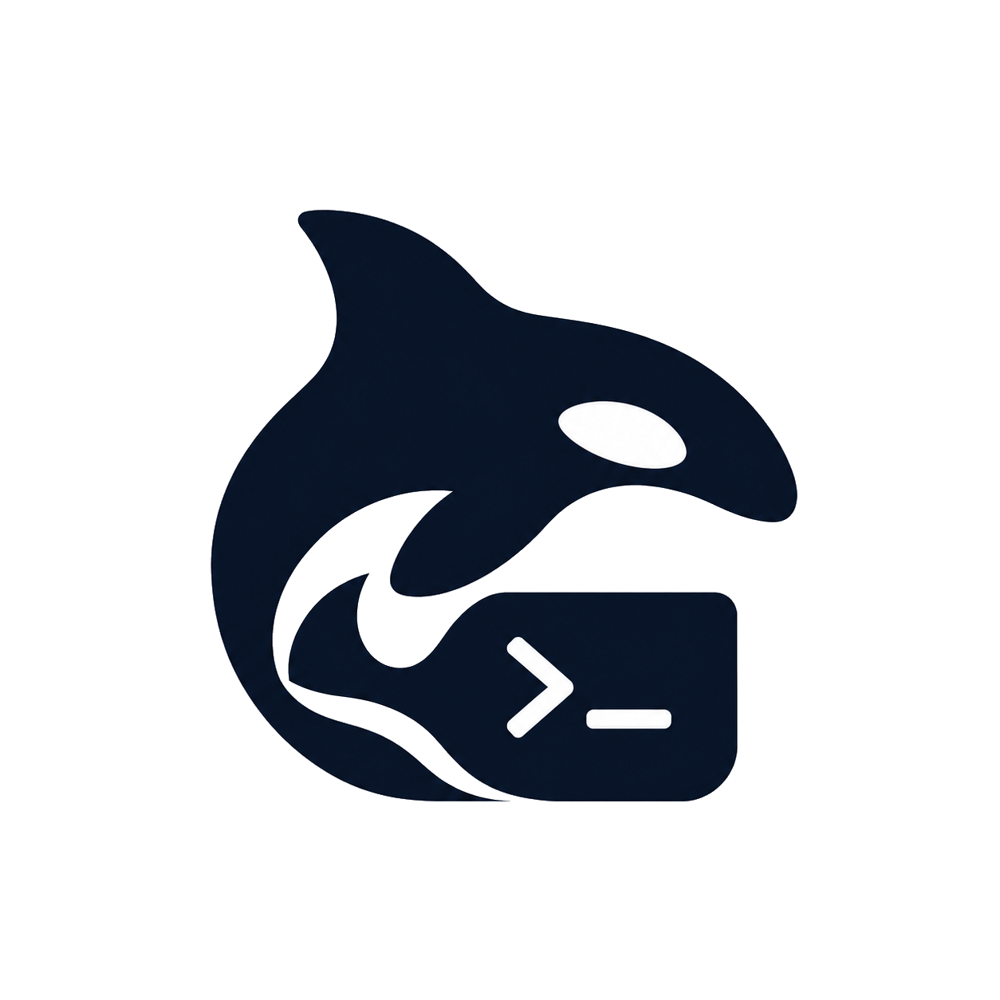

<p align="center">
  
</p>

<h1 align="center">Orca Code</h1>

<p align="center">
  A local coding agent that runs on your computer with Ollama.
</p>

<p align="center">
  Choose a workspace. Orca Code reads and edits files, runs the terminal and Git,
  checks the result, and keeps going.
  <br />
  No cloud API key.
</p>

---

## Quickstart

Install dependencies and start the app:

```shell
npm install
npm run tauri dev
```

The first launch prepares the local runtime:

- If Ollama is missing, Orca Code installs it.
- If no model is installed, it downloads `qwen2.5-coder:7b`.
- If the server is down, Orca Code starts it.

A server started by the app stops when you close the window. An Ollama process that was already running is left alone.

To build the macOS app and disk image:

```shell
npm run tauri build
```

---

## Modes

**Agent** reads and edits files, and runs the terminal and Git.

**Ask** only reads and searches the workspace.

**Plan** drafts the steps and does not change files.

---

## Safety

Dangerous commands, deletes, edits outside the workspace, and GUI input stop for approval. Commands that would erase your home directory or system paths are blocked even if you approve them.

A task stores the original file once, at the start. Restore puts that snapshot back.

Passwords, tokens, and private keys are masked in logs and in the model context.

---

## Data

On macOS, app data lives in `~/Library/Application Support/dev.orca.code`.

Logs live in `~/Library/Logs/Orca Code/orca.log`.

---

## Development

```shell
cargo test --manifest-path src-tauri/Cargo.toml
npm run build
```
